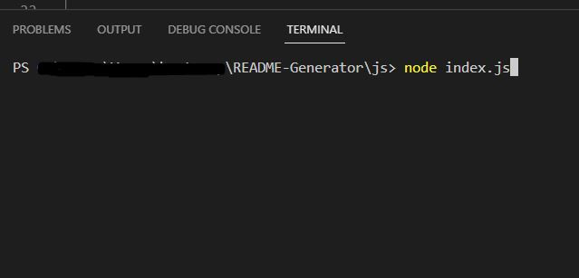
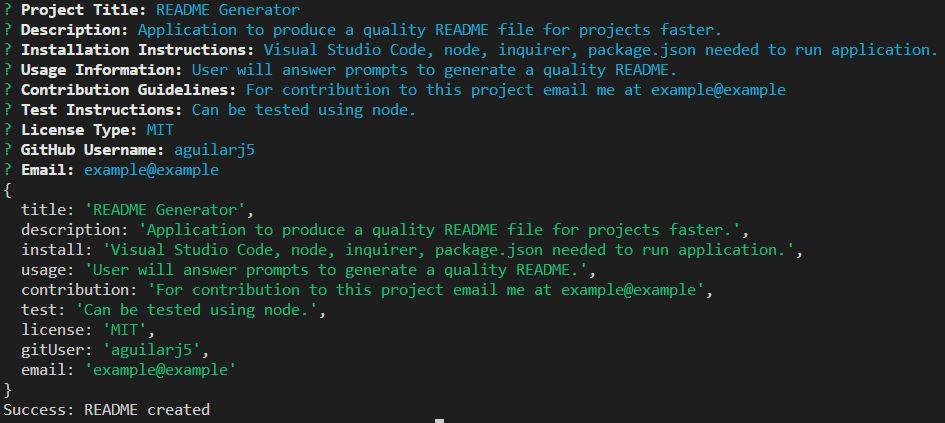
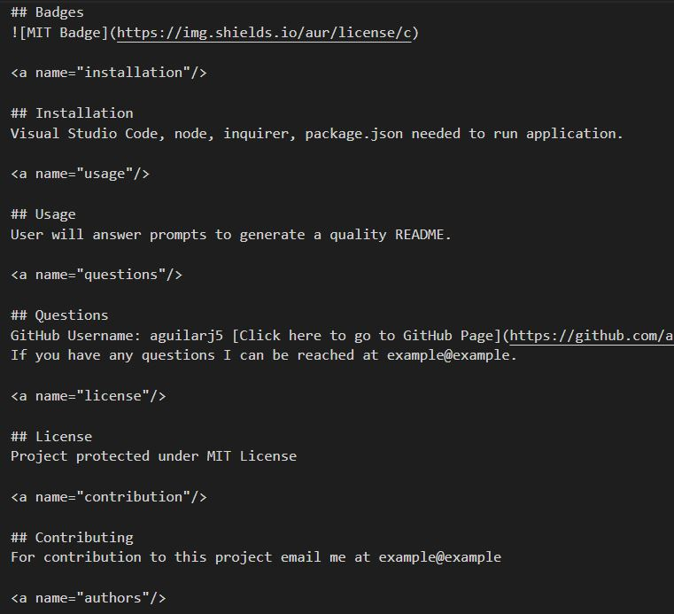

# README-Generator 2/2/2023

## README-Generator

## Description
This project is a README Generator that generates a quality README.md file for any project using prompts and inputs from the user/developer.

## Table of Contents
[Badges](#badges)

[Visuals](#visuals)

[Installation](#installation)

[Usage](#usage)

[Support](#support)

[Contribution](#contribution)

[Authors](#authors)

[License](#license)  

<a name="badges"/>

## Badges
N/A

<a name="visuals"/>

## Visuals

<a name="installation"/>

## Installation
This project can be cloned from my GitHub repo link found at the bottom of this project's README file. Once installed node, package.json files, and inquirer are required to be installed to be able to run this.

<a name="usage"/>

## Usage
This project could be used to produce quality README files for projects alot faster than writing one out manually.

<a name="support"/>

## Support
N/A

<a name="contribution"/>

## Contributing
The GitHub Repository can be found on the following this link [here.](https://github.com/aguilarj5/README-Generator.git)

<a name="authors"/>

## Authors and acknowledgment
Show your appreciation to those who have contributed to the project.

<a name="license"/>

## License
For open source projects, say how it is licensed.
